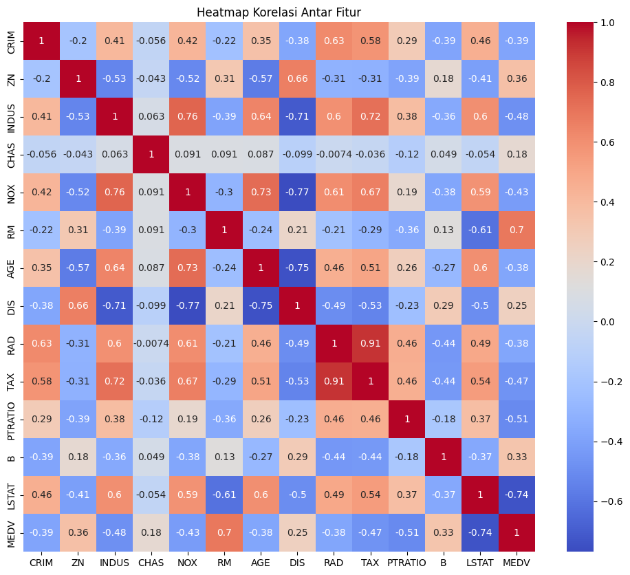

# 🏡 Prediksi Harga Rumah Boston
Proyek ini bertujuan untuk memprediksi harga rumah di wilayah Boston menggunakan dua model machine learning: Linear Regression dan Random Forest Regressor,
berdasarkan dataset Boston Housing. Proyek ini mengevaluasi performa kedua model dan menganalisis hubungan antar fitur terhadap harga rumah.

## 📁 Dataset
Dataset yang digunakan adalah Boston Housing Dataset, yang berisi informasi tentang berbagai fitur perumahan seperti:
- Jumlah kamar (RM)
- Tingkat polusi (NOX)
- Rasio siswa-guru (PTRATIO)
- Persentase penduduk berpenghasilan rendah (LSTAT)
- Pajak properti (TAX)
- Dan lain-lain.

## 🔍 Eksplorasi Data

   

Korelasi Antar Fitur
Visualisasi heatmap korelasi menunjukkan bahwa:
1. RM (jumlah kamar) memiliki korelasi positif tertinggi dengan harga rumah (MEDV) sebesar 0.70
2. LSTAT (persentase penduduk berstatus sosial rendah) memiliki korelasi negatif tertinggi dengan MEDV sebesar -0.74
3. Terdapat korelasi tinggi antara RAD dan TAX (0.91) yang menunjukkan potensi multikolinearitas

## ⚙️ Model yang Digunakan
1. Linear Regression
   Model dasar untuk memprediksi hubungan linier antara fitur dan harga rumah.
   - RMSE: 4.93
   - R² Score: 0.669
     
   📈 Plot Aktual vs Prediksi (Linear Regression)
   Model cenderung underfitting dan menghasilkan error besar pada harga rumah rendah dan tinggi.

2. Random Forest Regressor
   Model berbasis ensambel yang menangkap hubungan non-linear dan interaksi antar fitur.
   - RMSE: 2.81
   - R² Score: 0.892
   
   📈 Plot Aktual vs Prediksi (Random Forest)
   Model memberikan hasil yang jauh lebih akurat dan stabil, dengan prediksi mendekati nilai aktual.

**Perbandingan Visual:**

   

## 🧠 Insight dan Kesimpulan
| Model             | RMSE | R² Score | Catatan                                  |
| ----------------- | ---- | -------- | ---------------------------------------- |
| Linear Regression | 4.93 | 0.669    | Underfitting, sensitif terhadap outlier  |
| Random Forest     | 2.81 | 0.892    | Akurat, stabil, menangani non-linearitas |

✅ Random Forest adalah model terbaik untuk kasus ini.
Memberikan prediksi harga rumah yang mendekati kenyataan, dengan tingkat kesalahan minimum.

## 📌 Tools & Library
- Python
- Pandas, NumPy
- Matplotlib, Seaborn

## 📑 Data
 This data was taken from Kaggle
 
 [Link Dataset](https://www.kaggle.com/datasets/vivek468/superstore-dataset-final)

## 👩‍💻 Author

**Sinta Miftakhul Rohmah**  
Applied Mathematics student  
Universitas Islam Negeri Sunan Kalijaga, Yogyakarta  
📫 [LinkedIn](https://www.linkedin.com/in/sintamiftakhulr/)
